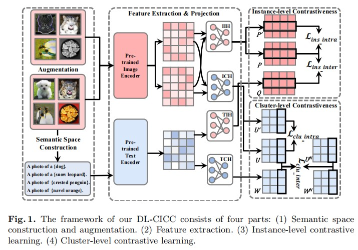
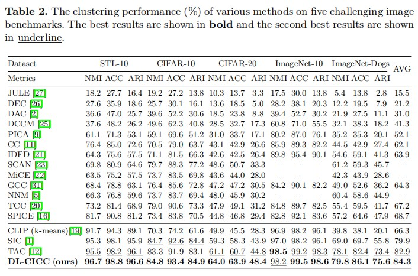

# Dual-Level Cross- and Intra–Modal Contrastive Clustering(DL-CICC)

This is the offical implementation of the paper entitled “Dual-Level Cross- and Intra–Modal Contrastive Clustering” . 

# Proposed Framework

# Main Results

# Dependency

- pytorch>=2.0.1
- torchvision>=0.15.2
- munkres>=1.1.4
- scikit-learn>=1.2.2
- clip>=1.0
- timm>=0.9.2
- faiss-gpu>=1.7.4

# Usage

##Training Commands

## Image and Text Embedding Inference
Firstly, you need to compute the image and text embedding with the CLIP model by running

> python image_embedding.py

> python text_embedding.py

## Text Counterpart Construction
Next, pick the best description for each image cluster.
> python filter_nouns.py

Then, we retrieve nouns for each image to compute its counterpart in the text modality by running

> python retrieve_text.py

## Heads Training

> python train_head.py

# If you find this is helpful for you, please star this hard working.
